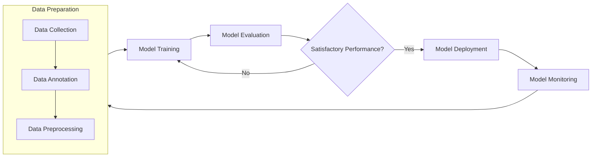

# Open Science AI Toolkit
Open source suite of tools, workflows, and processes designed to accelerate Open Science AI/ML development.
[](./noaa_ai_gui)

# Table of Contents
1. [Open Science AI Toolkit Overview](#overview)  
2. [Installation](#installation)  
3. [Features](#features)  
   - [Dataset Preparation](#features)  
     - [Filter Images with Labels](#1-filter-images-with-labels)  
     - [Create Labels for Background Images](#2-create-labels-for-background-images)  
     - [Validate YOLO Format](#3-validate-yolo-format-of-dataset)  
     - [Remap Class IDs](#4-remap-class-ids)  
     - [Split Dataset (train, val, test)](#5-split-dataset-into-trainvaltest)  
   - [Model Training](#features)  
   - [Model Exporting](#features)  
4. [**Applications**](#apps)  
   - [YOLO Object Detection Training GUI Application](#yolo-object-detection-training-gui-application)  
5. [**Notebooks**](#notebooks)  

### Overview
#### Python Toolkit

## Installation
To install the entire toolkit:
```
pip install git+https://github.com/MichaelAkridge-NOAA/open-science-ai-toolkit.git
```
## Features
The `noaa_ai_tools` subpackage provides functionalities like:
- **Dataset Preparation**: Easily prepare your datasets for training with functions for filtering and validating annotations.
- - **Filter Images with Labels**
- - **Create Labels for Background Images**
- - **Validate YOLO Format**
- - **Remap Class IDs**
- - **Split Dataset (train, val, test)**
- **Model Training**: Train and manage deep learning models, including support for YOLO models from Ultralytics(https://github.com/ultralytics/ultralytics).
- **Model Exporting**: Export trained models to various formats, including ONNX, TensorFlow Lite, Edge TPU, and NCNN.

## Example
```
from noaa_ai_tools import DeviceManager, ModelManager, ModelExporter

# Initialize the device
device = DeviceManager.initialize_device("0")  # Use "0" for GPU 0, "cpu" for CPU

# Setup and train the model
model_manager = ModelManager("yolo11m.pt", device)

# Define training configuration
train_config = {
    'data': 'path/to/data.yaml',  # Dataset configuration file
    'epochs': 100,               # Total training epochs
    'imgsz': 640,                # Image size
    'batch': 32,                 # Batch size
    'lr0': 0.001,                # Initial learning rate
    'lrf': 0.0001,               # Final learning rate
    'optimizer': 'AdamW',        # Optimizer
    'device': device,            # Device (handled internally)
    'save_period': 10,           # Save model every 10 epochs
    'patience': 10,              # Early stopping patience
    'augment': True,             # Enable data augmentation
    'mosaic': True,              # Enable mosaic augmentation
    'mixup': True,               # Enable mixup augmentation
    'cos_lr': True,              # Use cosine learning rate
    'project': 'training_logs',  # Save training logs here
}
model_manager.train(train_config)  # Start training

# Save the trained model
model_manager.save_model("path/to/save_model.pt")

# Export the trained model
exporter = ModelExporter(model_manager.model)
exporter.export_model(['onnx', 'tflite', 'edgetpu', 'ncnn'])  # Export in multiple formats

# Validate the model
validation_metrics = model_manager.validate('path/to/validation_data.yaml')
print("Validation Completed with Metrics:", validation_metrics)
```
## Example Usage
### 1. Filter Images with Labels
```
from noaa_ai_tools import filter_images_with_labels

filter_images_with_labels(
    image_folder="path/to/images",
    label_folder="path/to/labels",
    output_folder="path/to/output_images"
)
```
### 2. Create Labels for Background Images
```
from noaa_ai_tools import create_background_labels

create_background_labels(
    background_folder="path/to/background_images",
    output_image_folder="path/to/output_images",
    output_label_folder="path/to/output_labels"
)
```
### 3. Validate YOLO Format of dataset

```
from noaa_ai_tools import validate_yolo_format

invalid_files = validate_yolo_format(labels_folder="path/to/labels")
if invalid_files:
    print("Invalid YOLO files found:", invalid_files)
else:
    print("All YOLO files are valid!")
```
### 4. Remap Class IDs
```
from noaa_ai_tools import remap_class_ids

remap_class_ids(
    label_dir="path/to/labels",
    old_id="0",  # Old class ID
    new_id="1"   # New class ID
)
```
### 5. Split Dataset into Train/Val/Test
```
from noaa_ai_tools import split_dataset

split_dataset(
    images_dir="path/to/images",
    annotations_dir="path/to/labels",
    output_dir="path/to/output_splits",
    train_ratio=0.7, val_ratio=0.2, test_ratio=0.1
)
```
## File Structure Example
```
project-dataset-name/
│
├── input/                  # Input images and labels
│   ├── images/             # Original images
│   └── labels/             # YOLO format labels
│
└── output/                 # Outputs from the toolkit
    ├── filtered_images/    # Filtered images with labels
    ├── background_images/  # Background images with empty labels
    ├── splits/             # Train/val/test splits
    └── logs/               # Logs
```
## Apps
### Open Science AI Toolkit - GUI
[](./noaa_ai_gui)


## Notebooks
A collection of Jupyter notebooks for different stages of the AI/ML pipeline:

| Category                                         |  Name                                      | Description                                                                               | Deploy  | 
| ------------------------------------------------- | -------------------------------------------------- | ----------------------------------------------------------------------------------------- | --------|
| Data Preparation                                  | **Data Prep**                                      | Prepares training and testing datasets, and verifies metadata                             | placeholder| 
| Model Training                                    | **Train YOLO11 Model**                            | Configures parameters and trains YOLOv11 models                                           | placeholder  | 
| Model Training                                    | **Train YOLO11 Segment Model**                    | Configures parameters and trains YOLOv11 segmentation models                              | placeholder | 
| Model Training                                    | **Train YOLOv8 Model**                             | Configures parameters and trains YOLOv8 models                                            |placeholder| 
| Model Evaluation                                  | **Evaluate Models**                                | Generates metrics and performs comprehensive model testing                                | placeholder|
| Model Deployment                                  | **Publish Models**                                 | Publishes trained models to public repositories for community access                       | placeholder  | 

----------
#### Disclaimer
This repository is a scientific product and is not official communication of the National Oceanic and Atmospheric Administration, or the United States Department of Commerce. All NOAA GitHub project content is provided on an ‘as is’ basis and the user assumes responsibility for its use. Any claims against the Department of Commerce or Department of Commerce bureaus stemming from the use of this GitHub project will be governed by all applicable Federal law. Any reference to specific commercial products, processes, or services by service mark, trademark, manufacturer, or otherwise, does not constitute or imply their endorsement, recommendation or favoring by the Department of Commerce. The Department of Commerce seal and logo, or the seal and logo of a DOC bureau, shall not be used in any manner to imply endorsement of any commercial product or activity by DOC or the United States Government.

#### License
- This code is licensed as detailed in the [LICENSE.md](./LICENSE.md) file.
- For licensing details related to YOLO training, please refer to the [Ultralytics license](https://github.com/ultralytics/ultralytics?tab=readme-ov-file#license)

#### Credits
- https://github.com/ultralytics/ultralytics
