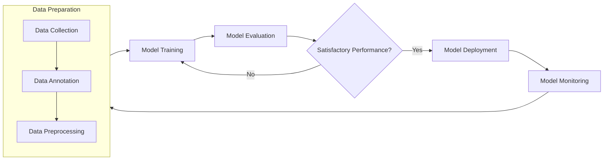

# Open Science AI Toolkit
Open source suite of tools, workflows, and processes designed to accelerate Open Science AI/ML development.

### Overview

## Installation
To install the entire toolkit:
```
pip install git+https://github.com/MichaelAkridge-NOAA/open-science-ai-toolkit.git
```
The `noaa_ai_tools` subpackage provides functionalities like:
- **Filter Images with Labels**
- **Create Background Images with Empty Labels**
- **Validate YOLO Format**
- **Remap Class IDs**
- **Split Dataset (train, val, test)**

## Example Usage
### 1. Filter Images with Labels
```
from noaa_ai_tools import filter_images_with_labels

filter_images_with_labels(
    image_folder="path/to/images",
    label_folder="path/to/labels",
    output_folder="path/to/output_images"
)
```
### 2. Create Background Images with Empty Labels
```
from noaa_ai_tools import create_background_labels

create_background_labels(
    background_folder="path/to/background_images",
    output_image_folder="path/to/output_images",
    output_label_folder="path/to/output_labels"
)
```
### 3. Validate YOLO Format

```
from noaa_ai_tools import validate_yolo_format

invalid_files = validate_yolo_format(labels_folder="path/to/labels")
if invalid_files:
    print("Invalid YOLO files found:", invalid_files)
else:
    print("All YOLO files are valid!")
```
### 4. Remap Class IDs
```
from noaa_ai_tools import remap_class_ids

remap_class_ids(
    label_dir="path/to/labels",
    old_id="0",  # Old class ID
    new_id="1"   # New class ID
)
```
### 5. Split Dataset
```
from noaa_ai_tools import split_dataset

split_dataset(
    images_dir="path/to/images",
    annotations_dir="path/to/labels",
    output_dir="path/to/output_splits",
    train_ratio=0.7, val_ratio=0.2, test_ratio=0.1
)
```


## Apps
*Placeholder for applications that streamline workflows.*

## Notebooks
A collection of Jupyter notebooks for different stages of the AI/ML pipeline:

| Category                                         |  Name                                      | Description                                                                               | Deploy  | 
| ------------------------------------------------- | -------------------------------------------------- | ----------------------------------------------------------------------------------------- | --------|
| Data Preparation                                  | **Data Prep**                                      | Prepares training and testing datasets, and verifies metadata                             | placeholder| 
| Model Training                                    | **Train YOLO11 Model**                            | Configures parameters and trains YOLOv11 models                                           | placeholder  | 
| Model Training                                    | **Train YOLO11 Segment Model**                    | Configures parameters and trains YOLOv11 segmentation models                              | placeholder | 
| Model Training                                    | **Train YOLOv8 Model**                             | Configures parameters and trains YOLOv8 models                                            |placeholder| 
| Model Evaluation                                  | **Evaluate Models**                                | Generates metrics and performs comprehensive model testing                                | placeholder|
| Model Deployment                                  | **Publish Models**                                 | Publishes trained models to public repositories for community access                       | placeholder  | 

----------
#### Disclaimer
This repository is a scientific product and is not official communication of the National Oceanic and Atmospheric Administration, or the United States Department of Commerce. All NOAA GitHub project content is provided on an ‘as is’ basis and the user assumes responsibility for its use. Any claims against the Department of Commerce or Department of Commerce bureaus stemming from the use of this GitHub project will be governed by all applicable Federal law. Any reference to specific commercial products, processes, or services by service mark, trademark, manufacturer, or otherwise, does not constitute or imply their endorsement, recommendation or favoring by the Department of Commerce. The Department of Commerce seal and logo, or the seal and logo of a DOC bureau, shall not be used in any manner to imply endorsement of any commercial product or activity by DOC or the United States Government.

##### License
See the [LICENSE.md](./LICENSE.md) for details
