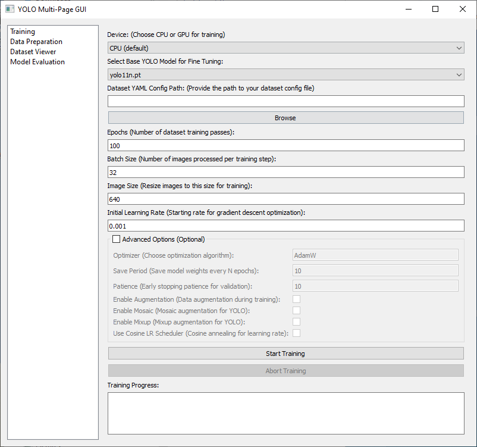

# In Dev
## YOLO Gui - Slapped together GUI with custom functions
```
pip install git+https://github.com/MichaelAkridge-NOAA/open-science-ai-toolkit.git
```
# Run - via CMD
```
noaa-ai-gui
```


# OR - Just YOLO Object Detection Training GUI Application


## Using the GUI
- Device: Select CPU or GPU.
- Model: Choose a YOLO model (e.g., yolo11n.pt).
- Dataset Config Path: Browse to your dataset YAML file.
- Training Parameters: Set epochs, batch size, and image size.
- Advanced Options: Optionally configure optimizer, save period, augmentation, etc.
- Start Training: Click the button to begin.
- Monitor Progress: View real-time logs in the scrollable progress text box.
- Abort Training: Click the abort button to stop training.

## Troubleshooting
### Common Issues:
- CUDA Not Found (GPU): Ensure the correct version of CUDA is installed for your PyTorch version. Check the PyTorch installation guide.
- Missing Dataset Config: Ensure the data path in your YAML file is correct.
- Unknown: Check the Training Logs. If training fails, check training_log.txt for detailed error messages.

## Example Dataset Yaml: 
### urchin_dataset.yaml
```
train: images/train
val: images/val
test: images/test

nc: 1
names: ['urchin']
```

# credits - icons
- https://fontawesome.com/